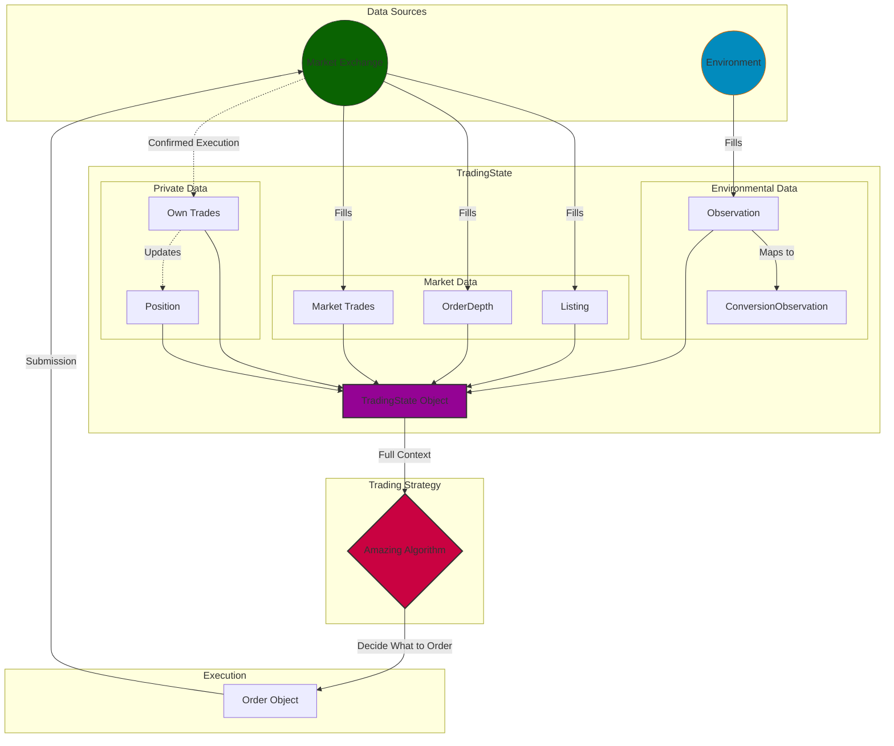

# IMC4 Trading Challenge  
Various codes for the IMC4 Trading Challenge  

## Quick Start
Use a virtual env
```bash
python3 -m venv venv
source venv/bin/activate
pip3 install -m requirements.txt
```
To run your amazing algorithm, we are using [this]() backtester. Follow the instructions to download it, and then run it by 
```bash
prosperity4btx trader.py n
```
for round $n$.
## architectural plans

## datamodel.py
To better understand the data structure of TradeState class, we can utilize a diagram!

This is all taken from the definition of datamodel.py as is done [here](https://imc-prosperity.notion.site/writing-an-algorithm-in-python) in Appendix B. It should explain the basic game loop. 