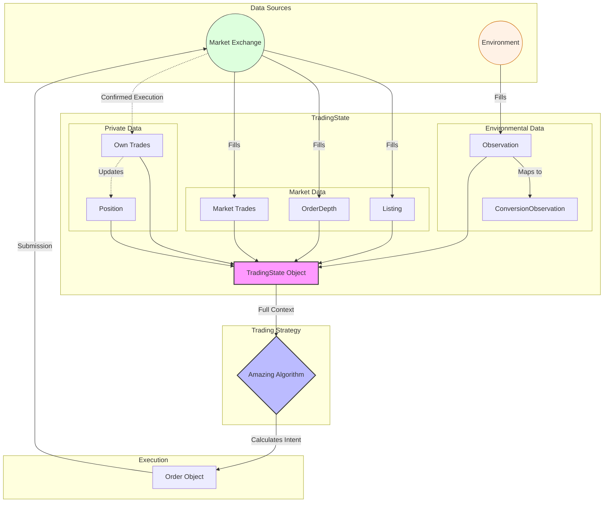

# IMC4 Trading Challenge  
Various codes for the IMC4 Trading Challenge  

## Quick Start
Use a virtual env
```bash
python3 -m venv venv
source venv/bin/activate
pip3 install -m requirements.txt
```
  
## datamodel.py
To better understand the data structure of TradeState class, we can utilize a diagram!
