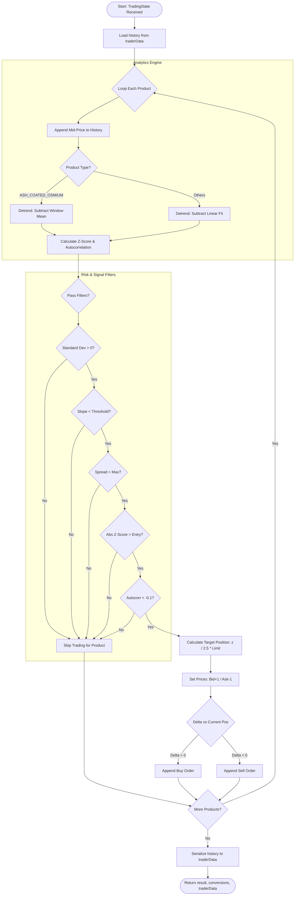

# ROUND 1

Remove NaNs

### Product Analysis Summary: INTARIAN_PEPPER_ROOT
Remove the linear trend
| Day | Slope ($m$) | Intercept ($b$) | % Above Trend | % Below Trend |
| :--- | :--- | :--- | :--- | :--- |
| **Day -2** | 0.1002 | 9999.97 | 50.51% | 49.49% |
| **Day -1** | 0.1002 | 11000.13 | 50.38% | 49.62% |
| **Day 0** | 0.1002 | 12000.17 | 51.03% | 48.97% |
| **Day 1 (MA)** | 0.1002 | 9999.97 | 82.77% | 16.87% |

**Key Insights:**
* **Fixed Drift:** The slope is nearly identical across all three days (~0.1002), indicating a constant upward price pressure.
* **Base Reset:** The intercept increases by 1,000 units exactly each day, suggesting a systematic opening price adjustment.
* **High Symmetry:** The near 50/50 split between above/below trend values confirms the linear detrending is a highly effective model for this product.

### Strategy
